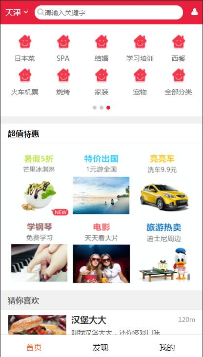
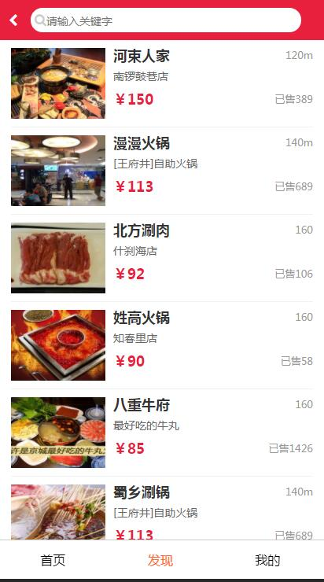
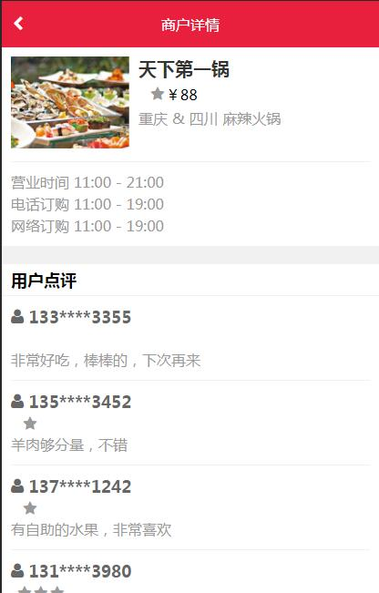

### 从零开始使用React全家桶开发电商系统

### 技术栈：
react + react-router4.1 + redux + koa2 + koa-router + less + ES6/7 + webpack + fetch + bundle-loader

### 项目说明：

### 基于 react react-router redux 的项目，主要是为了学习实战react全家桶

### 下载

 	git clone https://github.com/CodeVpe/react-v.git

 	cd dianping

 	npm install

### 运行（nodejs 7.6.0+）
```
 npm run dev (正常编译模式)

 访问 http://localhost:8081

 npm run build （发布生产版本，对代码进行混淆压缩，提取公共代码，分离css文件）
```


## 附项目截图







